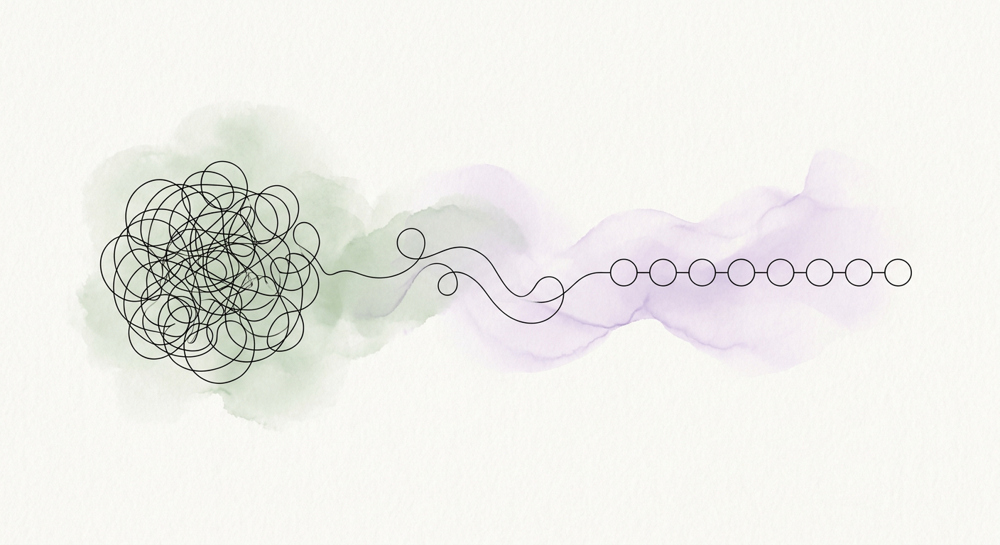

<div align="center">
  
</div>

# Break It Down 🌿

A "Gentle AI" task management system designed to reduce cognitive load through recursive AI-powered task decomposition and minimalist motion design.

## ✨ Key Features
- **Gentle AI Breakdown**: Uses Groq to turn overwhelming goals into tiny, non-threatening steps.
- **Infinite Recursion**: Any step can be broken down further into even tinier sub-steps.
- **Calming Motion Design**: Built with a custom spring-based animation system for a soft, weighted UI feel.
- **Smart Persistence**: Dual-layer sync with Supabase and localStorage for an instant, offline-first experience.

## 📖 Documentation
For a deep dive into the project's structure, AI prompts, and design philosophy, see:
👉 **[ARCHITECTURE.md](./ARCHITECTURE.md)**

## 🚀 Getting Started

**Prerequisites:** Node.js

1. **Install dependencies:**
   ```bash
   npm install
   ```
2. **Set up Environment Variables:**
   Copy `.env.example` to `.env.local` and add your keys for:
   - `GROQ_API_KEY`
   - `NEXT_PUBLIC_SUPABASE_URL`
   - `NEXT_PUBLIC_SUPABASE_ANON_KEY`

3. **Run the app:**
   ```bash
   npm run dev
   ```

---
Built with care for a calmer productivity experience.
